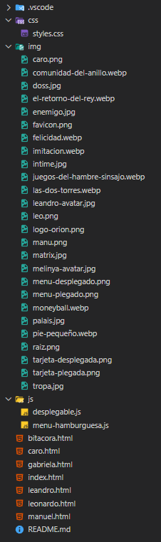
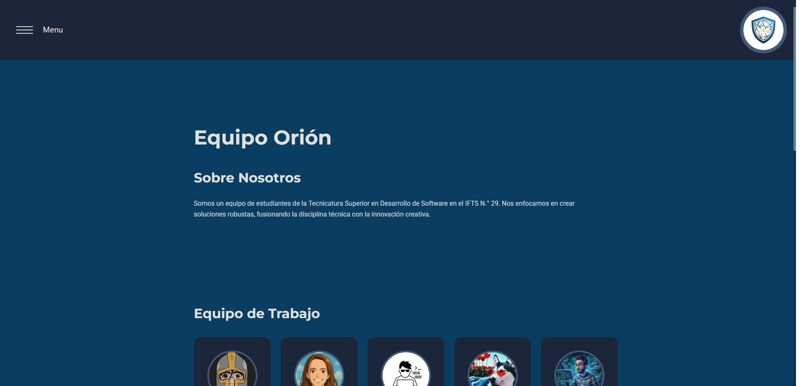
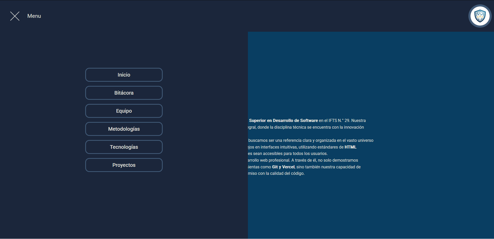
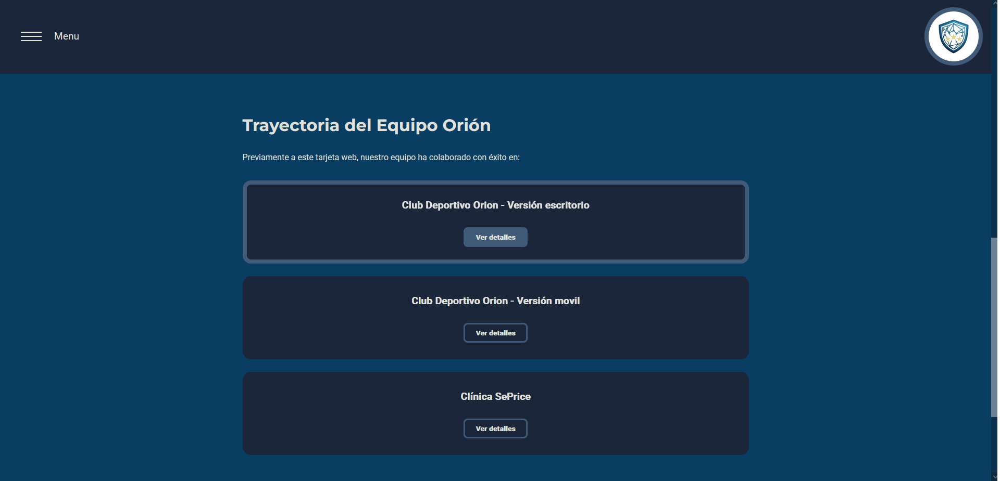
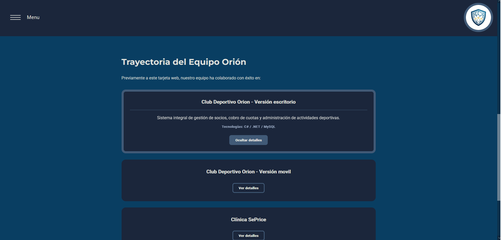

# Proyecto Web del Equipo Orión - TP1

Trabajo Práctico Grupal N° 1 Landing page Equipo Orión

## Descripción del Proyecto

El presente trabajo práctico consiste en el desarrollo de la landing page del Grupo Orión, creada para la materia Desarrollo de Sistemas Web (Front End). Su objetivo principal es presentar al equipo y sus integrantes aplicando buenas prácticas de HTML semántico y diseño responsivo. Entre sus funcionalidades básicas, el sitio incluye un menú de navegación adaptable y accesible para dispositivos móviles, así como tarjetas de presentación interactivas que permiten desplegar información detallada de manera dinámica sin necesidad de recargar la página.

## Repositorio y enlace al Proyecto Desplegado

- [x] Repositorio en GitHub creado
- [x] **Enlace en Vercel:** [Ver sitio](https://tp-01-g16.vercel.app/)

---

## Integrantes del Equipo Orión

- [x] **Carolina Corradi** [GitHub](https://github.com/carotramp)
- [x] **Manuel Espíndola** [GitHub](https://github.com/Filogos)
- [x] **Leandro Ferrero** [GitHub](https://github.com/LeaFerrero)
- [x] **Gabriela Gonzalez** [GitHub](https://github.com/melinya-byte)
- [x] **Leonardo Vargas** [GitHub](https://github.com/leonardofvp)

---

## Tecnologías Utilizadas

- HTML5 (Estructura semántica)
- CSS3 (Flexbox, Media Queries, Variables)
- JavaScript (Manipulación del DOM, Eventos)
- Google Fonts (Tipografías)
- Vercel (Despliegue)
- Git & GitHub (Control de versiones)

---

## Estructura de Archivos

El proyecto se ha organizado siguiendo los lineamientos de buenas prácticas, separando los recursos en sus respectivas carpetas:

- [x] Archivo `index.html` y páginas individuales ubicadas en la raíz.
- [x] Carpeta `/css` que contiene la hoja de estilos global `styles.css`.
- [x] Carpeta `/js` que contiene `desplegable.js` y `menu-hamburguesa.js`.
- [x] Carpeta `/img` para almacenamiento de recursos gráficos, logos y avatares.
- [x] Archivo `bitacora.html` registro del proceso de desarrollo incluido en el menú principal.
- [x] Archivo `README.md` actualizado con descripción y checklist.

---

## Funcionalidades Básicas: Funciones dinámicas en JavaScript

Se han implementado funciones dinámicas para mejorar la interactividad del usuario sin necesidad de recargar la página:

- [x] **Menú de Hamburguesa (`menu-hamburguesa.js`):** Permite desplegar y ocultar la barra de navegación en dispositivos móviles al hacer clic en el botón de tres líneas horizontales.
      
      
- [x] **Tarjetas interactivas (`desplegable.js`):** Muestra u oculta información detallada (como artista, año, etc.) en las tarjetas de presentación al presionar el botón "Ver detalles". El texto del botón cambia dinámicamente a "Ocultar detalles" cuando la información está visible.
      
      
- [x] Las funcionalidades dinámicas fueron implementadas tanto en la portada como en las páginas individuales de cada integrante.

---

## Estructura y Diseño (HTML y CSS)

- [x] Estructura Semántica: Páginas organizadas con etiquetas como `<header>`, `<nav>`, `<main>`, `<section>` y `<article>`, respetando el directorio raíz para las páginas individuales.
- [x] **Diseño Responsivo** (Flexbox y Media Queries): Las tarjetas y el layout se adaptan automáticamente a distintos tamaños de pantalla (móviles, tablets y escritorios).
- [x] **Variables y Estilos:** Uso de variables en CSS para mantener una paleta de colores consistente (`--color-principal`, `--color-secundario`, etc.) y tipografías (Montserrat y Roboto) importadas desde Google Fonts.

---

## Guía de Estilos

### Paleta de Colores:

- Color principal: `#093e62`
- Color secundario: `#1b263b`
- Color de detalles: `#415a77`
- Color de texto principal: `#e0e1dd`
- Color de texto secundario: `#8b9bb4`

### Tipografías:

- [x] Uso de Google Fonts
- Títulos: [Montserrat](https://fonts.google.com/specimen/Montserrat)
- Cuerpo del texto: [Roboto](https://fonts.google.com/specimen/Roboto)

- [x] **Iconografía:** El diseño y la interacción del sitio se realizaron con código nativo, transiciones de CSS y elementos interactivos personalizados en HTML semántico.

- [x] **Transiciones:** Efectos visuales al pasar el cursor (hover) sobre botones y elementos interactivos.

---

## Privacidad y Datos Personales

- Aviso de privacidad: Algunos nombres, información y avatares/imágenes utilizados son ficticios, creados exclusivamente para preservar la identidad y privacidad de los integrantes del equipo.

---

## Uso de Herramientas de Inteligencia Artificial

Para optimizar el flujo de desarrollo y mantener buenas prácticas en el código, se integró el uso de herramientas de Inteligencia Artificial como asistente técnico:

- **Herramientas utilizadas:** Gemini Pro y ChatGPT.
- **Uso en Lógica y Debugging:**
  - Se utilizó Gemini Pro para generar la base de los estilos CSS y optimizar la estructura del código JavaScript (`desplegable.js`).
    - **Criterio de prompt:** Se le solicitó generar código CSS para tener una base de estilos con la que iniciar, y optimizar scripts de JS puro para alternar clases en el DOM.
  - Se utilizó ChatGPT como apoyo para resolver dudas de estructura HTML, adaptación al diseño grupal y corrección de estilos.
    - **Criterio de prompt:** Se le ingresaron fragmentos de código con problemas de alineación responsiva, pidiendo identificar errores y ajustar el layout para que coincida con el resto del equipo.
- **Imágenes:**
  - Algunas ilustraciones del proyecto (por ejemplo, el logo del equipo) fueron creadas utilizando generación de imágenes con IA (Gemini Pro).
    - **Criterio de prompt:** Se le solicitó generar un emblema minimalista utilizando una paleta de colores azules, que representara el concepto de la constelación de Orión y el trabajo en equipo tecnológico.

